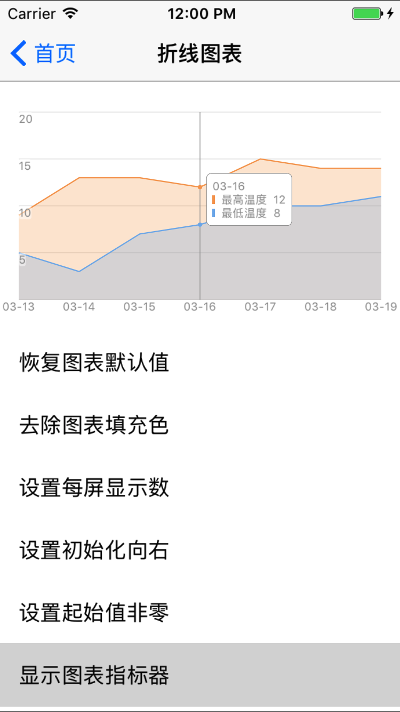
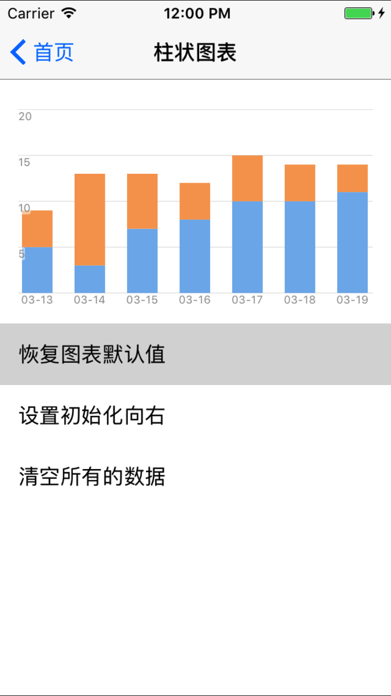

# GLChart

[](https://travis-ci.org/gaoli/GLChart)
[](http://cocoapods.org/pods/GLChart)
[](http://cocoapods.org/pods/GLChart)
[](http://cocoapods.org/pods/GLChart)

## Screenshots

 &nbsp;


## Usage

To run the example project, clone the repo, and run `pod install` from the Example directory first.

### LineChart

```
#import "GLChartData.h"
#import "GLLineChart.h"

GLChartData *chartData = [[GLChartData alloc] init];
GLLineChart *lineChart = [[GLLineChart alloc] init];

chartData.xValues = @[@"10:01", @"10:02", @"10:03", @"10:04", @"10:05",
                      @"10:06", @"10:07", @"10:08", @"10:09", @"10:10"];
					  
chartData.yValues = @[@{@"color": @"#7CB5EC",
                        @"value": @[@18, @20, @18, @20, @18,
                                    @20, @18, @20, @18, @20]},
                      @{@"color": @"#F7A35C",
                        @"value": @[@8,  @10, @8,  @10, @8,
                                    @10, @8,  @10, @8,  @10]}];

lineChart.chartData = chartData;
```

### BarChart

```
#import "GLChartData.h"
#import "GLBarChart.h"

GLChartData *chartData = [[GLChartData alloc] init];
GLLineChart *barChart  = [[GLBarChart  alloc] init];

chartData.xValues = @[@"10:01", @"10:02", @"10:03", @"10:04", @"10:05",
                      @"10:06", @"10:07", @"10:08", @"10:09", @"10:10"];
					  
chartData.yValues = @[@[@{@"value": @10, @"color": @"#7ED321"}, @{@"value": @5, @"color": @"#E74C3C"}],
                      @[@{@"value": @10, @"color": @"#7ED321"}, @{@"value": @5, @"color": @"#E74C3C"}],
                      @[@{@"value": @10, @"color": @"#7ED321"}, @{@"value": @5, @"color": @"#E74C3C"}],
                      @[@{@"value": @10, @"color": @"#7ED321"}, @{@"value": @5, @"color": @"#E74C3C"}],
                      @[@{@"value": @10, @"color": @"#7ED321"}, @{@"value": @5, @"color": @"#E74C3C"}],
                      @[@{@"value": @10, @"color": @"#7ED321"}, @{@"value": @5, @"color": @"#E74C3C"}],
                      @[@{@"value": @10, @"color": @"#7ED321"}, @{@"value": @5, @"color": @"#E74C3C"}],
                      @[@{@"value": @10, @"color": @"#7ED321"}, @{@"value": @5, @"color": @"#E74C3C"}],
                      @[@{@"value": @10, @"color": @"#7ED321"}, @{@"value": @5, @"color": @"#E74C3C"}],
                      @[@{@"value": @10, @"color": @"#7ED321"}, @{@"value": @5, @"color": @"#E74C3C"}]];

barChart.chartData = chartData;
```

## Installation

GLChart is available through [CocoaPods](http://cocoapods.org). To install
it, simply add the following line to your Podfile:

```ruby
pod "GLChart"
```

## Author

gaoli, 3071730@qq.com

## License

GLChart is available under the MIT license. See the LICENSE file for more info.
